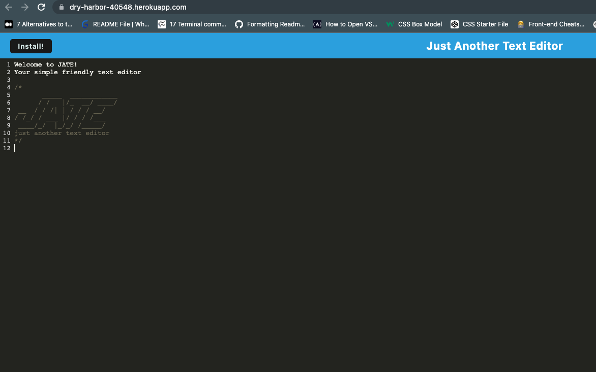
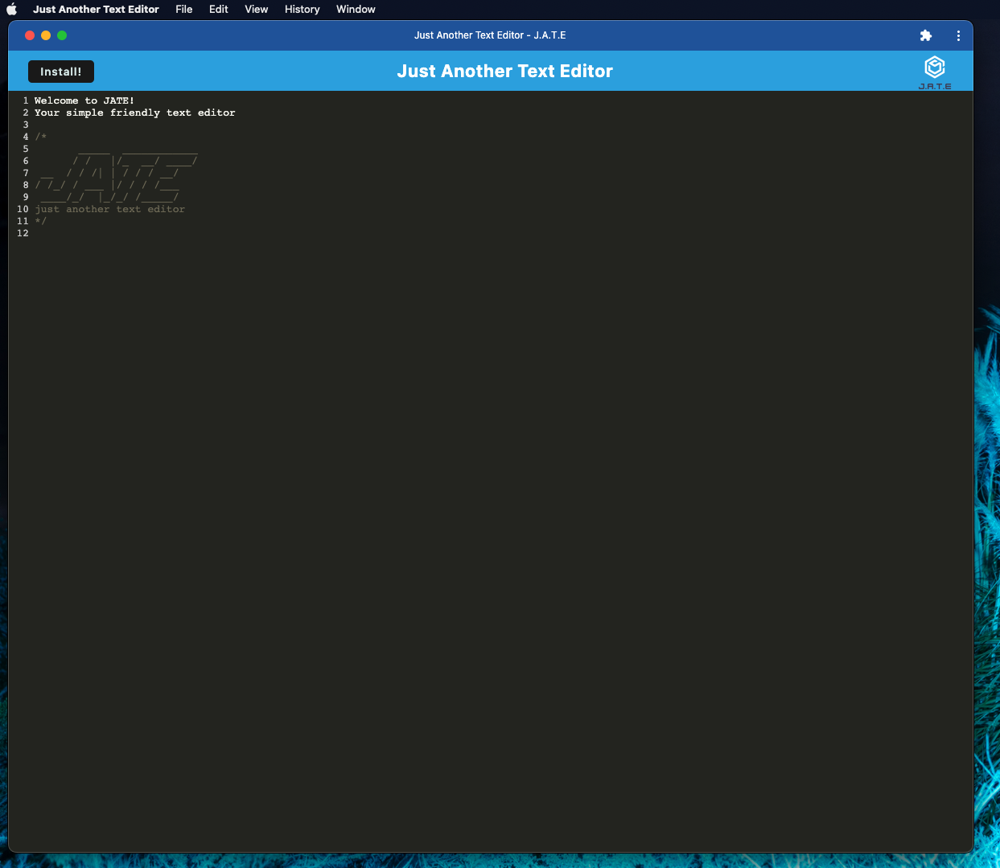
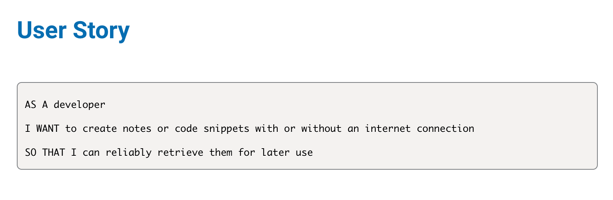

# JATE ("Just Another Text Editor")

- Challenge 19 assignment for UoB Bootcamp due 14-11-22
- Deployed link: https://dry-harbor-40548.herokuapp.com/

Image of deployed application:



Image of downloaded application:



Contents:

1. Summary
2. Key features
3. Issues encountered/further amendments
4. Credits

## 1. Summary

This project was undertaken as a submission for a Birmingham University Bootcamp assignment, with a brief to build a text editor that runs in the browser. It must be a single-page application that meets the PWA criteria.  The user story and acceptance criteria is as follows:



- GIVEN a text editor web application
- WHEN I open my application in my editor
- THEN I should see a client server folder structure
- WHEN I run `npm run start` from the root directory
- THEN I find that my application should start up the backend and serve the client
- WHEN I run the text editor application from my terminal
- THEN I find that my JavaScript files have been bundled using webpack
- WHEN I run my webpack plugins
- THEN I find that I have a generated HTML file, service worker, and a manifest file
- WHEN I use next-gen JavaScript in my application
- THEN I find that the text editor still functions in the browser without errors
- WHEN I open the text editor
- THEN I find that IndexedDB has immediately created a database storage
- WHEN I enter content and subsequently click off of the DOM window
- THEN I find that the content in the text editor has been saved with IndexedDB
- WHEN I reopen the text editor after closing it
- THEN I find that the content in the text editor has been retrieved from our IndexedDB
- WHEN I click on the Install button
- THEN I download my web application as an icon on my desktop
- WHEN I load my web application
- THEN I should have a registered service worker using workbox
- WHEN I register a service worker
- THEN I should have my static assets pre cached upon loading along with subsequent pages and static assets
- WHEN I deploy to Heroku
- THEN I should have proper build scripts for a webpack application


## 2. Key features:

- When ```npm start``` is run, the application starts up at the backend and serves the client.
- JS files are bundles using webpack and an HTML file, service worker and manifest file is generated.
- Database storage is created and when the DOM window is clicked off, the content in the editor is saved.
- When the 'install' button is clicked, the application is downloaded to desktop.


## 3. Issues encountered/further amendments

- Deploying to Heroku was originally an issue.  The push was rejected and I was receiving at 'pre-receive hook declined' error.  I eventually solved this by ensuring that express.js was not installed twice (across two package.json files) and a couple of missing dependencies were installed.

- As far as I am aware, all criteria are met.

## 4. Credits

- starter code: https://github.com/coding-boot-camp/cautious-meme